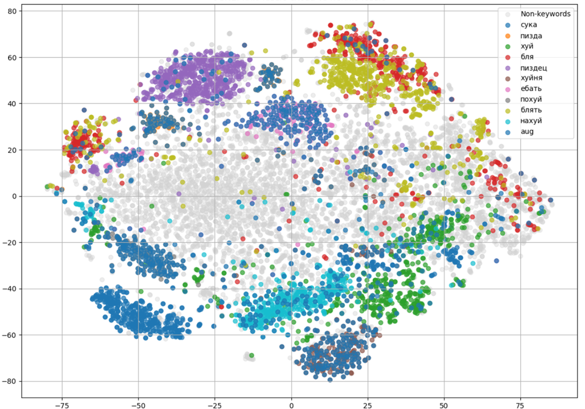

# Weak Labels, Strong Words: Detecting Swear Words in Russian Audio

> **University Project** | *Collaborative Research*

This project implements a robust **Keyword Spotting (KWS)** system designed to detect specific Russian profanities in short audio segments. Despite using "weakly labeled" data (auto-segmented by Whisper) and dealing with high class imbalance, the final model achieves an **F1-score of 0.95**.

The system focuses on detecting 10 specific keywords: *blyat, pizdyets, blya, hui, nahui, suka, yebat, huinya, pohui, pizda*.

---

## 📊 Key Results

We systematically compared baseline approaches (CNN on Spectrograms) with Transfer Learning methods (Whisper Encoder, Wav2Vec2).

| Model Architecture | Input Features | Accuracy | **F1 Score** |
| :--- | :--- | :--- | :--- |
| Linear Baseline | Log-Mel Spectrogram | 63.8% | 56.4% |
| CNN + Focal Loss | Log-Mel Spectrogram | 74.6% | 75.5% |
| **Wav2Vec2 (Top-12 Layers) + MLP** | **Raw Audio Embeddings** | **94.8%** | **94.7%** |

> **Key Insight:** We found that the *top 12 layers* of Wav2Vec2 capture phonetic information better for this task than the full 24-layer model, which tends to over-specialize in semantic content.

---

## 🏗️ Methodology

### 1. Data Pipeline
* **Source:** [RuDevice (SOVA Dataset)](https://sova.ai/ru/dataset/) - Real-world conversational Russian speech.
* **Preprocessing:**
    * Filtered audio containing the target keywords.
    * Used **Whisper Small** for automatic segmentation (Weak Supervision) to extract <1s chunks.
    * Applied **Data Augmentation** (additive noise) to balance rare classes like *pizda* and *pohui*.
* **Dataset Size:** ~5,000 samples balanced between Positive (Swear) and Negative (Non-swear) classes.

### 2. Model Architecture
The best performing model utilizes a frozen **Wav2Vec2-XLSR-53 (Russian)** encoder truncated to the first 12 transformer layers.

1.  **Feature Extractor:** Wav2Vec2 (Layers 1-12) $\rightarrow$ Mean Pooling over time.
2.  **Classifier (MLP):** Linear (1024 $\to$ 128) $\to$ ReLU $\to$ Dropout (0.2) $\to$ Linear (128 $\to$ 1) $\to$ Sigmoid.
3.  **Loss Function:** Binary Cross Entropy (BCEWithLogitsLoss). Experiments with Focal Loss and Contrastive Loss were conducted to handle augmentations.

---

## 🔍 Error Analysis & Visualizations

### Embedding Space (t-SNE)
The Wav2Vec2 embeddings formed well-separated clusters for each keyword, confirming the model's ability to distinguish phonetic nuances even in noisy conditions.

*(Figure 1 from Report: t-SNE projection of word embeddings. Colored points = swear words, Grey = non-keywords)*

### Attention Analysis
We analyzed the attention weights to understand False Negatives (FN). True Positives (TP) showed dense focus on the keyword occurrence, whereas False Negatives exhibited flat attention distributions, indicating potential failure in localization.

*(Figure 2 from Report: Average attention weights for True Positives vs False Negatives)*
